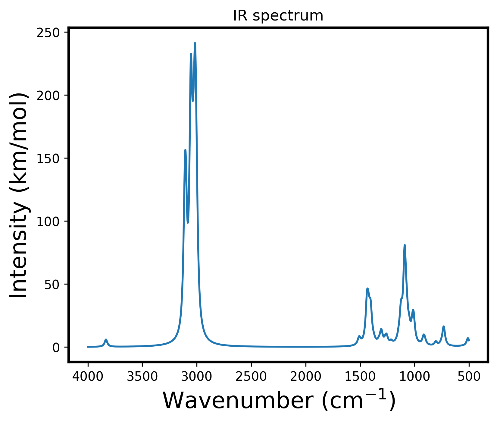

# Example session — IR spectrum of hexanol with AIQM2

A complete, real end-to-end run of Aitomia, reproducing the kind of IR-spectrum
calculation shown in the paper. The agent was given a single natural-language
request and drove the entire workflow itself: confirming intent, choosing the
method and programs, fetching the molecule from PubChem, optimizing the
geometry, computing the vibrational frequencies and IR intensities, and plotting
the spectrum.

- **Request:** `calculate IR spectrum of hexanol with AIQM2`
- **LLM:** `qwen3-max-preview` (OpenAI-compatible API)
- **Chemistry:** [MLatom](https://github.com/dralgroup/mlatom) 3.22.0 — AIQM2 method, `geometric`
  for optimization, `pyscf`/`xtb` for the frequency/IR step
- **How to run it yourself:** `python examples/run_calculation.py`
  (or interactively: `python main.py`, then type the request)

The raw artifacts from this run are in
[`example_session/`](example_session/): the full transcript, the two
agent-generated MLatom scripts, the per-step summaries, and the spectrum image.

---

## 1. Transcript (abridged)

Full transcript: [`example_session/transcript.txt`](example_session/transcript.txt).

```
USER
    calculate IR spectrum of hexanol with AIQM2

AITOMIA
    ... I'm interpreting your request as wanting to actually run an IR spectrum
    calculation for hexanol using the AIQM2 method ... Could you confirm?

USER
    yes

AITOMIA
    **Method**: AIQM2
    **Method program**: No specific method program required (AIQM2 is a QM/ML hybrid)
    **Calculation program**:
    - Geometry optimization: Geometric
    - Frequency calculation: PySCF
    Do you confirm these as the final computational parameters?

USER
    yes

AITOMIA
    Key results:
    - Final Energy (optimized): -311.9445321237846 Hartree
    - All 57 vibrational frequencies real -> true minimum confirmed
    - Key peaks:
        - O-H stretch: 3833.5 cm^-1
        - C-H stretches: 2996-3112 cm^-1 (up to 125 km/mol)
        - C-O stretch: 1090.0 cm^-1 (49.7 km/mol)
    - Output files: hexanol_AIQM2_optimization/optmol.json,
                    hexanol_AIQM2_IR/irmol.json
    Status: Completed
```

## 2. What the agent generated and ran

The agent wrote and executed plain MLatom scripts — no hidden machinery.

**Geometry optimization** ([`run_geomopt.py`](example_session/geometry_optimization/run_geomopt.py)):

```python
import mlatom as ml

mol = ml.molecule.load('.../hexanol.json', format='json')
MODEL = ml.methods(method='AIQM2', program=None)
geomopt = ml.optimize_geometry(model=MODEL, initial_molecule=mol, program='geometric')
optmol = geomopt.optimized_molecule
```

**Frequencies + IR spectrum** ([`run_ir.py`](example_session/ir_spectrum/run_ir.py)):

```python
import mlatom as ml

mol = ml.molecule.load('.../optmol.json', format='json')
MODEL = ml.methods(method='AIQM2', program=None)
freq = ml.freq(molecule=mol, model=MODEL, program='pyscf', ir=True)
spectrum = ml.spectra.ir.lorentzian(molecule=mol, fwhm=30)
spectrum.plot('ir.png')
```

## 3. Results

- **Optimized energy:** −311.9445321 Hartree
- **Imaginary frequencies:** 0 (the optimized structure is a true minimum)
- **Characteristic bands:** O–H stretch 3833.5 cm⁻¹; C–H stretches 2996–3112 cm⁻¹
  (strongest); C–O stretch 1090.0 cm⁻¹

Per-step summaries:
[`geometry_optimization/summary.out`](example_session/geometry_optimization/summary.out),
[`ir_spectrum/summary.out`](example_session/ir_spectrum/summary.out).

### IR spectrum



---

> **Note on reproducibility.** Aitomia is an LLM-driven agent, so the exact
> wording and tool-routing can vary between runs and between models. A *capable*
> model is needed — weaker models may mis-route a tool call (e.g. the
> molecule-retrieval step) and stall. The run above used `qwen3-max-preview`.
